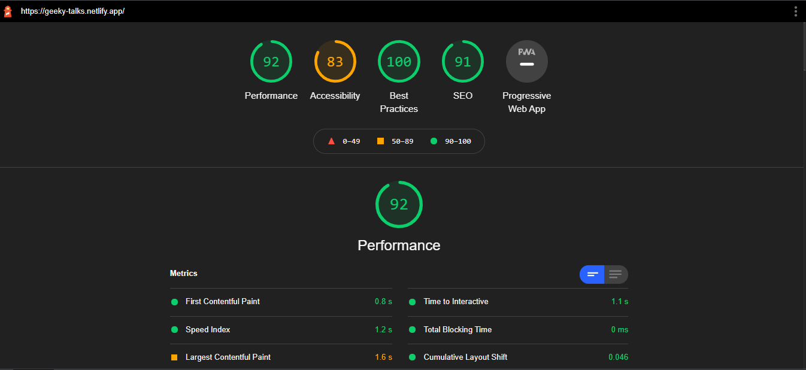
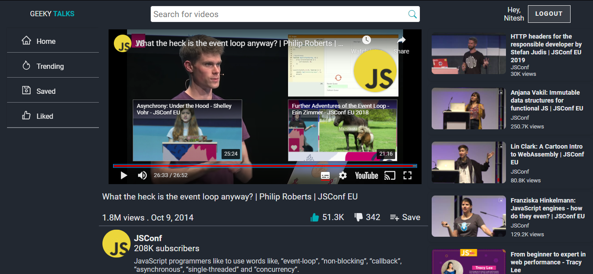

# geeky-talks

## Backend:
- [Server-repl](https://replit.com/@theniteshnarang/geeky-talks-backend#index.js)
- [Code-github](https://github.com/theniteshnarang/geeky-talks-backend/tree/development)

## A Video Library For Geeky People

- The purpose of designing and building this project was, it's hard to be focused when you have so much distraction around. So, it's better to curb all the distraction at once.

## Lighthouse Report


## Highlight Features
- Optimised Network Calls
- Private And Protected Route
- Fallback To Login For Unauthorized User.
- 92% Lighthouse Performance Report
- Good User Experience
- Robustness to User Interaction

## Addtional Features

- Login/Sign-up
- JWT Authentication
- Data Persistance with REST-full API
- Password saving using bcript and salt
- Mobile Responsive
- Video Listing Page
- Single Video Page
- Create Your Own Playlist
- Remove Your Playlist
- Add Specifc Video to the Playlist
- Remove Specific Video from Playlist
- Add To Like
- Remove From Like
- Search Videos With the Name
- Form Validation using Formik

## Tech Stack
- React
- React-Redux, Redux-toolkit for Global State Management
- Element Design for UI designing (My component library)
- MongoDB for storing documents
- Mongoose for interacting with MongoDB
- Express for Network Calls and Middlewares

## Test Credentials
```
Email: nitesh@mail
Password: nitesh
```

## Screens

### Video Listing


### Video Single


### Create Playlist


### Video Save


### Login/Signup

